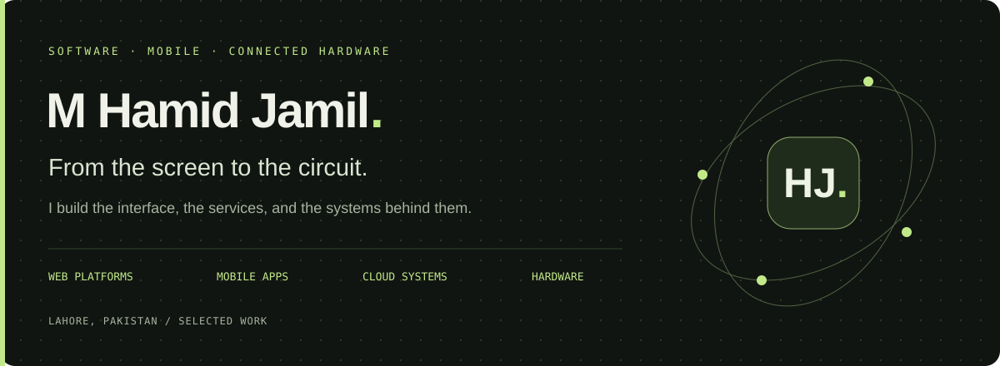

  <a href="https://portfolio.innovorix.com/work"><strong>Explore my work ↗</strong></a> &nbsp; · &nbsp;
  <a href="https://portfolio.innovorix.com">About me</a> &nbsp; · &nbsp;
  <a href="https://www.linkedin.com/in/muhammad-hamid-jamil-009b5916b/">LinkedIn</a> &nbsp; · &nbsp;
  <a href="https://innovorix.com">Innovorix</a>

## I build the whole journey.

I'm **Hamid**, a software engineer in **Lahore, Pakistan**. My work connects web platforms, mobile applications and physical devices: from a restaurant's kitchen board to an institute's fee desk, from a home-visit booking to an arrival alert delivered through an ESP32.

I enjoy taking a practical problem through interface design, backend engineering, deployment and day-to-day operation.

## Selected work

Every project below has a case study covering **why it exists, what I built and how it fits together**.

| Project | What I built | Explore |
| :--- | :--- | :--- |
| **Wrap Topia** | Restaurant ordering, a live kitchen board, counter sales and rider workflows around one backend. | [Case study](https://portfolio.innovorix.com/about-wraptopia) · [Website](https://wraptopia.innovorix.com) |
| **Innovorix** | Institute management connecting admissions, attendance, fees, exams and guardian communication. Previously Academia. | [Case study](https://portfolio.innovorix.com/about-innovorix) · [Website](https://innovorix.com) |
| **Spotwire** | Arrival alerts, visit timelines, linked accounts and workspace attendance. Previously TextGate. | [Case study](https://portfolio.innovorix.com/about-spotwire) · [Google Play](https://play.google.com/store/apps/details?id=com.spotwire.app) · [Source](https://github.com/mhamidjamil/ttgo-sms-app) |
| **PakSehat** | Home-healthcare bookings, doctor selection, visit updates and patient-doctor chat. | [Case study](https://portfolio.innovorix.com/about-paksehat) · [Google Play](https://play.google.com/store/apps/details?id=com.paksehat.app) |
| **DolphinPK** | Dolphin Foods' storefront, checkout, payment verification, stock and staff tools. | [Case study](https://portfolio.innovorix.com/about-dolphinpk) · [Website](https://www.dolphinpk.com) |
| **Lilibet London** | A monochrome fashion catalogue with an Atelier back office and enquiry management. | [Case study](https://portfolio.innovorix.com/about-lilibetlondon) · [Website](https://lilibetlondon.pk) |
| **Baileys WhatsApp Gateway** | My shared messaging service built on Baileys, with number linking, queues and per-application credentials. | [Case study](https://portfolio.innovorix.com/about-baileys) |
| **AhmedSales OS** | An agency workspace connecting sales, delivery, invoicing and client communication. | [Case study](https://portfolio.innovorix.com/about-ahmedsales) |

## Beyond the screen

My hardware work connects **sensing, communication and control** to software people can use.

| Project | What it does | Explore |
| :--- | :--- | :--- |
| **GSM SMS Gateway** | ESP32 + SIM800 firmware that turns cloud jobs into SMS and call operations. Powers Spotwire's Pakistani SMS route. | [Case study](https://portfolio.innovorix.com/about-ttgo-tcall) · [Source](https://github.com/mhamidjamil/TTGO_TCall) |
| **Orange Pi Automation Hub** | A serial bridge, web console, telemetry and scheduled automation on an Orange Pi 5 Plus. | [Case study](https://portfolio.innovorix.com/about-orangepi) · [Source](https://github.com/mhamidjamil/orangepi) |
| **Remote USB Keyboard** | ESP32-S3 firmware translating input from a phone or browser into USB keystrokes. | [Case study](https://portfolio.innovorix.com/about-esp32-keyboard) · [Source](https://github.com/mhamidjamil/ESP32-S3_work) |
| **Door Monitoring** | A wireless door-lock prototype with sensing, servo control and opening alerts. | [Case study](https://portfolio.innovorix.com/about-door-monitoring) · [Source](https://github.com/mhamidjamil/Door-Monitoring) |
| **Watcher** | Ultrasonic movement detection and radio alerts using embedded sensors. | [Case study](https://portfolio.innovorix.com/about-watcher) · [Source](https://github.com/mhamidjamil/Watcher) |
| **Water Leak Detector** | An ESP32 that wakes on water detection and sends a phone notification. | [Case study](https://portfolio.innovorix.com/about-water-sensor) · [Source](https://github.com/mhamidjamil/esp32_for_water_sensor) |

## Tools behind the work

| Area | Technologies |
| :--- | :--- |
| **Web & backend** | Ruby on Rails · Hotwire · Next.js · React · TypeScript · Node.js · Fastify |
| **Mobile** | Flutter · Dart · Kotlin · Jetpack Compose · Firebase |
| **Data & infrastructure** | PostgreSQL · Prisma · Drizzle · Redis · Docker · Cloudflare · GitHub Actions · Datadog |
| **Hardware** | C++ · Python · ESP32 / ESP32-S3 · SIM800 · Orange Pi · Arduino · PlatformIO |

---

**Have a product, workflow or connected-device idea?** [Let's talk on LinkedIn ↗](https://www.linkedin.com/in/muhammad-hamid-jamil-009b5916b/)

Project stories and working links, maintained alongside my [portfolio source](https://github.com/mhamidjamil/portfolio).
